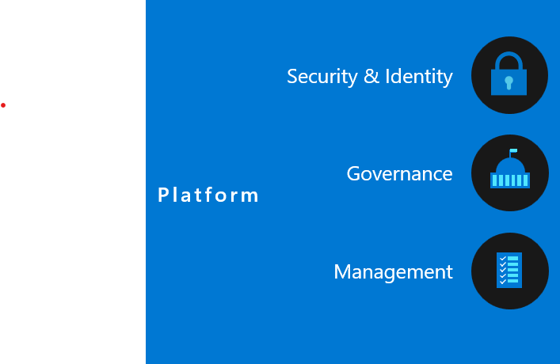

# Azure DevOps Services Best Practices

This repository is a collection of users experience of Azure DevOps primarily focused on the governance and management of the platform. Through my experiences working with large enterprise customers I hope to bring to light some of the common challenges that organisations face when using the platform. 

Best practices will be focusing on the following areas. How users (mostly Devs) use the platform and how administrators manage the platform. 

_Disclaimer: I work for Microsoft but do not provide this documentation on behalf of Microsoft. As there is a gap in documentation I hope to use this repository to create a set of best practices that you can leverage to help you on your journey of using the platform._
